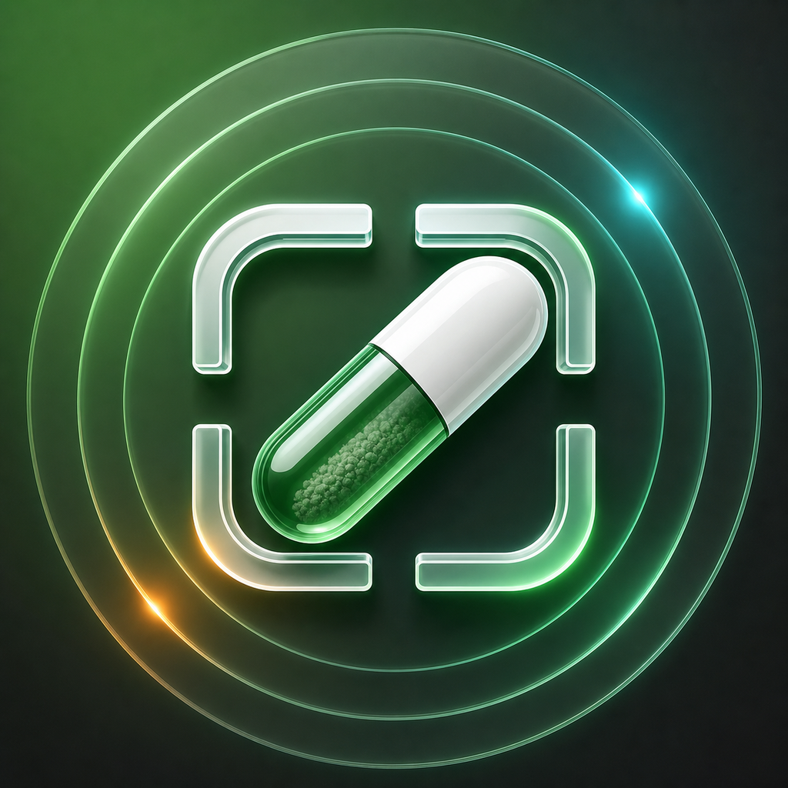
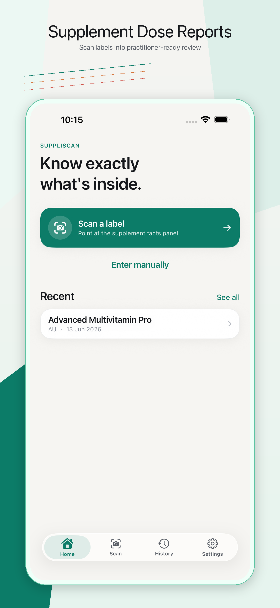
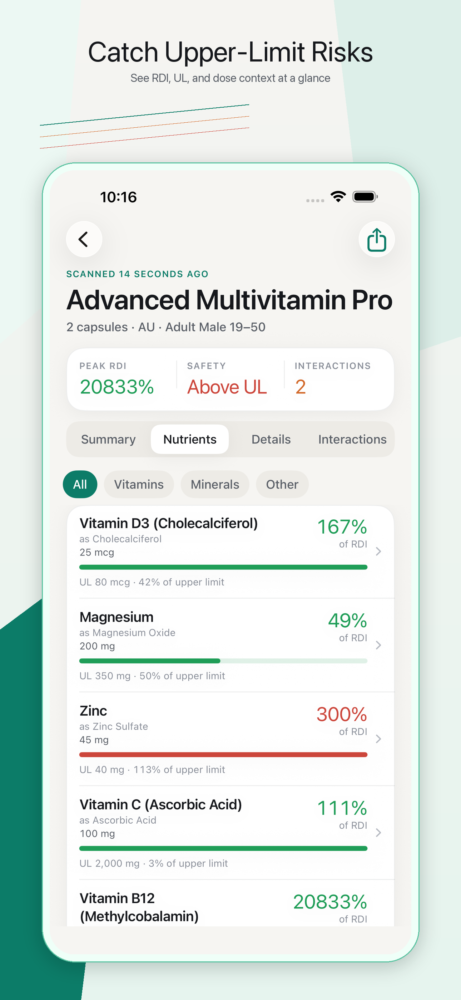
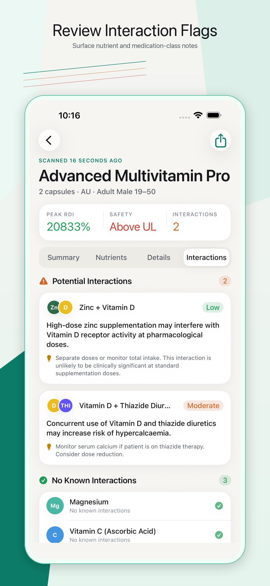
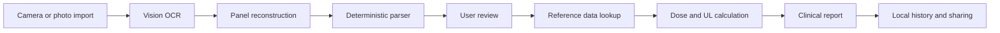

# SuppliScan

<p align="center">
  
</p>

SuppliScan is a native iPhone app that turns supplement labels into structured, dose-aware reports for practitioner review.

It exists because supplement labels are too dense for the moment people actually need to read them. A bottle can list elemental amounts, compound amounts, serving ranges, RDI context, upper-limit risk, herbal extracts, probiotic strains, and ingredient forms in a layout that was never designed for fast clinical reasoning. SuppliScan narrows the problem to that exact moment: scan the label, review the extracted rows, then generate a report that explains dose relevance, reference context, form quality, and safety flags.

The core idea is simple: OCR is only the intake path. The product value is the interpretation layer after OCR.

<p align="center">
  
  
  
</p>

## Current Status

SuppliScan is in active pre-release development.

- App target: iOS 26.0+, iPhone only
- Bundle ID: `montygiovenco.SuppliScan`
- Version: `1.0`
- Build system: Xcode project, no third-party package dependencies
- App Store asset pack: icon, metadata, review notes, privacy copy, and screenshot plans are drafted under `Marketing/AppStore/`
- Launch blocker: OCR is undergoing an accuracy overhaul and final screenshots should be recaptured from the OCR-complete build

The project was originally planned under the working name `NutriScan`. Some planning documents still use that codename. The product name, app target, bundle ID, App Store assets, and current code use `SuppliScan`.

## Who It Is For

SuppliScan is built for people who need to understand supplement labels with more discipline than a generic scanner gives them.

- Dietitians, nutritionists, naturopaths, integrative GPs, pharmacists, and clinicians reviewing supplement products
- Researchers, students, and public-health minded users who need reference context rather than marketing copy
- Educated supplement users comparing products at the shelf
- Carers or patients preparing a report to discuss with a qualified practitioner
- Builders and reviewers who want to see a privacy-first, Apple-native health reference workflow implemented in SwiftUI

The app is intentionally not a diagnosis tool, prescription tool, supplement recommendation engine, or replacement for clinical judgment.

## What It Does

SuppliScan scans or imports a supplement label and converts it into typed, reviewable data:

- Nutrient rows with amount, unit, form, canonical name, serving adjustment, RDI context, and UL context
- Herbal rows with extract type, dry equivalent, standardisation, amount, and notes
- Probiotic rows with strains and CFU values
- Unresolved OCR lines that require manual review instead of being hidden
- Flags for nutrients above UL, nutrients near UL, low-bioavailability forms, unresolved entries, serving-size adjustments, nutrient interactions, and medication-class interaction notes
- A shareable summary card rendered with SwiftUI `ImageRenderer`, plus structured text for Notes, Mail, Messages, and other share destinations
- Local scan history with SwiftData

Every generated analysis includes a disclaimer:

> This report is for practitioner reference only. It does not constitute medical advice or therapeutic recommendation. Always exercise independent clinical judgment.

## Why This Exists

Most nutrition and shopping apps answer broad consumer questions: calories, macros, additives, barcode identity, price, or simple product scores.

SuppliScan is aimed at a narrower and more clinically useful question:

> What does this supplement label actually provide, and what context matters before someone treats it as meaningful?

That question creates a different product:

- Dose comes first. A glamorous ingredient at a trivial dose should not look impressive.
- Upper limits matter. A nutrient can look beneficial while approaching or exceeding a tolerable upper intake level.
- Serving size matters. A "per 2 tablets" label should not be interpreted as a one-tablet dose.
- Form matters. Magnesium glycinate and magnesium oxide should not be treated as interchangeable product quality signals.
- Unknown data stays unknown. A missing amount is not coerced to zero.
- OCR needs review. Health-adjacent data should pass through a human correction step before analysis.

## The User Flow



The flow is built around a deliberate review gate. OCR output never jumps straight into clinical-looking results. The user can correct rows, confirm serving size, choose AU, US, or EU reference standards, choose a demographic, and then generate the report.

## What Users Learn

SuppliScan teaches supplement literacy through the report itself:

- How a label amount compares with RDI, EAR, AI, or UL reference values
- Why the selected serving size changes every calculation
- Which nutrients have no established reference data
- Why some ingredients appear in detail but do not drive RDI or UL calculations
- Why probiotic and herbal labels need different report sections from vitamins and minerals
- Which interactions deserve practitioner review when the relevant nutrient is present
- Why "more" is not the same as "better"

The product does not lecture the user. It shows the evidence structure and lets the report do the teaching.

## Where It Is Useful

- At point of purchase when comparing two supplement labels quickly
- In clinic before discussing a product with a patient
- During supplement-stack review, especially when a single product already approaches UL thresholds
- In nutrition education, where students need to connect labels to reference standards
- In public-health or regulatory discussions about how supplement information is communicated
- In personal health organization, where a user wants a clean report to bring to a practitioner

## How It Compares

| Category | Typical focus | SuppliScan focus |
|---|---|---|
| Calorie and macro trackers | Food logging, calorie totals, macro goals | Supplement dose relevance and reference context |
| Barcode product apps | Product identity and database lookup | Label interpretation even when no product database exists |
| Generic OCR tools | Text extraction | Typed supplement entries, review flags, and report generation |
| Additive or score apps | Simple consumer verdicts | Practitioner-readable evidence hierarchy |
| Drug databases | Medication monographs and interaction databases | Supplement-label capture with nutrient, herbal, probiotic, and serving-size context |

SuppliScan does not try to be the broadest scanner. It tries to be the most useful scanner for supplement labels.

## Product Decisions

This repo is as much a product management exercise as an engineering one. The important choices are visible in the codebase and docs.

### Narrow the Wedge

The app focuses on supplement labels instead of general food scanning. That keeps the data model honest: nutrients, herbals, probiotics, raw OCR lines, serving sizes, reference standards, and report flags all have first-class types.

### Make OCR Reviewable

OCR is treated as evidence, not truth. The parser preserves uncertain lines, tracks low-confidence output, and sends the user through Review before analysis.

### Use Deterministic Calculations

RDI and UL calculations are deterministic and on-device. The service boundary makes this explicit:

- `ParserService` extracts typed entries
- `UnitConversionService` converts IU where supported
- `CalculationService` applies the serving multiplier exactly once
- `ReportService` assembles the analysis and flags

### Keep Clinical Boundaries Clear

SuppliScan provides reference context and documentation. It avoids diagnosis, treatment claims, personalized advice, and supplement recommendations. The disclaimer is stored on every `LabelAnalysis`.

### Design for Trust Before Scale

The v1 architecture favors bundled reference data, local persistence, no accounts, no analytics SDK, and no remote OCR upload. Cloud sync, barcode databases, and practitioner dashboards are deferred because they would change the trust and privacy model.

### Build the Roadmap in Layers

The roadmap is staged around increasing product risk:

1. `v1`: single-label clinical core, local reports, scan history, shareable summaries
2. `v2`: stack intelligence, cumulative UL detection, comparison mode, deeper interaction work
3. `v3`: Apple platform expansion such as HealthKit writes, Spotlight, widgets, Siri, and Watch if the product strategy supports tracking

This is the unglamorous part that makes the glamorous part possible: scope control, data boundaries, launch gates, and clear deferrals.

## Technical Architecture

SuppliScan is a Swift 6.2, SwiftUI, SwiftData, Vision, App Intents, and CoreSpotlight iOS app.

### Platform

- Swift 6.2
- iOS 26.0+
- iPhone only
- SwiftUI with `@Observable`
- SwiftData with a versioned schema
- Vision text recognition with iOS 26 document recognition support
- AVFoundation camera capture
- PhotosUI import
- App Intents, Shortcuts, and Spotlight hooks for the supplement library
- OSLog for structured logging
- Privacy manifest with UserDefaults access declaration
- No third-party package dependencies

### Service Graph

```text
SwiftUI View
  -> @Observable ViewModel
      -> OCRService
      -> ParserService
      -> ReferenceDataService
      -> FormQualityService
      -> InteractionService
      -> ReportService
      -> PersistenceService
```

Views render state and send user actions. ViewModels coordinate services. Services own parsing, calculation, reference lookup, report assembly, and persistence. SwiftData writes and deletes go through `PersistenceService`, an actor conforming to `ModelActor`.

### Key Source Areas

| Area | Path | Notes |
|---|---|---|
| App entry and dependency injection | `SuppliScan/SuppliScan/App/` | `SuppliScanApp` creates the model container and injects `AppDependencies` |
| Features | `SuppliScan/SuppliScan/Features/` | Home, Scan, Review, Analysis, History, Library, Settings |
| Reusable UI | `SuppliScan/SuppliScan/Components/` | Report rows, summary cards, flags, pickers, disclaimer |
| Design system | `SuppliScan/SuppliScan/DesignSystem/` | Theme tokens, surfaces, buttons, segmented controls, tab bar |
| Services | `SuppliScan/SuppliScan/Services/` | OCR, parsing, reference lookup, form quality, interactions, report assembly |
| Models | `SuppliScan/SuppliScan/Models/` | Codable, Sendable domain types for entries, analysis, flags, references |
| Persistence | `SuppliScan/SuppliScan/Persistence/` | Versioned SwiftData schema and actor-isolated persistence |
| App Intents | `SuppliScan/SuppliScan/AppIntents/` | Shortcuts, Spotlight donation, library deep links |
| Reference data | `SuppliScan/SuppliScan/Resources/ReferenceData/` | AU, US, EU reference data, aliases, form quality, interactions, supplement knowledge |
| Tests | `SuppliScan/SuppliScanTests/` | Parser, calculation, OCR, unit conversion, library, lexicon, ViewModel tests |
| UI tests | `SuppliScan/SuppliScanUITests/` | Launch and guided app-flow tests |
| App Store | `Marketing/AppStore/` | Metadata, privacy answers, review notes, screenshots, icon assets |
| Training data | `TrainingData/` | Real supplement-label corpus and expected parsed fixtures |

## OCR and Parsing

The OCR pipeline is designed around supplement labels rather than generic text:

- Images are downsampled before recognition to protect memory.
- Vision runs multiple recognition passes over original, contrast, and sharpened image variants.
- iOS 26 document recognition contributes structured text lines when available.
- OCR lines retain confidence, source pass IDs, alternatives in debug builds, and bounding regions.
- `OCRPanelReconstructor` attempts to separate the supplement panel from surrounding package text.
- `ParserService` classifies rows into `LabelEntry.nutrient`, `.herbal`, `.probiotic`, or `.unresolved`.
- Ambiguous or unsupported content is preserved for review instead of silently discarded.

The test corpus includes real supplement labels covering single nutrients, multi-nutrient capsules, powders, probiotics, herbals, EU-style decimal commas, total summary lines, variable dosing, and IU conversion.

## Reference Data

Bundled JSON data drives the analysis:

- `nrv_au.json`
- `nrv_us.json`
- `nrv_eu.json`
- `aliases.json`
- `nutrition_lexicon.json`
- `form_quality.json`
- `interactions.json`
- `supplement_knowledge.json`

Reference data is loaded into actors at app launch. Updating standards or adding aliases can be done through data files rather than rewriting UI screens.

## Privacy Model

SuppliScan is privacy-first by product design, not just by policy text.

- No account system
- No analytics SDK
- No ad SDK
- No remote OCR upload path in the current app code
- Scan history is stored locally with SwiftData
- Preferences are stored locally with UserDefaults / AppStorage
- App Store privacy draft currently answers "Data Not Collected"
- Camera access is for photographing supplement labels for on-device recognition

If future AI gap-fill, sync, crash reporting, accounts, or analytics are added, the privacy policy and App Store privacy answers must be updated before release.

## Quality Gates

The repo treats health-adjacent UX as a correctness problem:

- `CalculationService` rejects IU values that were not converted before calculation
- Serving multipliers are applied in one place only
- `amount: Double?` preserves unknown dose values instead of pretending they are zero
- `LabelAnalysis` requires a schema version and disclaimer
- SwiftData writes go through `PersistenceService`
- Low-confidence OCR creates review warnings
- Debug builds can emit OCR evidence bundles for traceability
- App Store copy and screenshots are maintained separately from app code

The scheme is configured for simulator builds and UI testing. Full release readiness still depends on the OCR overhaul and final acceptance testing.

## Running Locally

Requirements:

- macOS with Xcode capable of building iOS 26 apps
- iOS 26 simulator, preferably an iPhone 17 Pro Max simulator for screenshot parity
- Apple Developer team configured if installing on a physical device

List schemes:

```sh
xcodebuild -list -project SuppliScan/SuppliScan.xcodeproj
```

Build:

```sh
xcodebuild build \
  -project SuppliScan/SuppliScan.xcodeproj \
  -scheme SuppliScan \
  -destination 'platform=iOS Simulator,name=iPhone 17 Pro Max'
```

Run tests:

```sh
xcodebuild test \
  -project SuppliScan/SuppliScan.xcodeproj \
  -scheme SuppliScan \
  -destination 'platform=iOS Simulator,name=iPhone 17 Pro Max'
```

Generate App Store screenshots after the OCR-complete build:

```sh
Tools/capture_app_store_screenshots.sh
```

## App Store Submission Work

Submission material lives in `Marketing/AppStore/`:

- `metadata-en-US.md`
- `privacy.md`
- `review-notes.md`
- `submission-checklist.md`
- `screenshot-plan.md`
- `whats-new.md`
- `Icon/`
- `Screenshots/`

Do not submit until:

- OCR overhaul is complete and verified against real supplement labels
- final screenshots are regenerated from the OCR-complete build
- Privacy Policy URL and Support URL are live
- TestFlight smoke testing passes on at least one real iPhone
- clinical boundary language is reviewed one final time

## Roadmap

### v1: Clinical Core

- On-device supplement-label OCR
- Reviewable typed entries
- AU / US / EU reference standards
- RDI, EAR, AI, and UL context
- Form quality lookup
- Interaction flags where curated data exists
- Local scan history
- Shareable report summary

### v2: Stack Intelligence

- Multi-product stack analysis
- Cumulative UL detection across products
- Product comparison mode
- Practitioner notes
- More complete interaction workflow with clinical and legal review
- Barcode shortcut if a reliable product data source exists

### v3: Apple Platform Expansion

- Spotlight expansion beyond the library
- HealthKit nutrient writes if the product remains analysis-first and the UX clearly distinguishes label amount from confirmed intake
- Siri and Shortcuts for scan entry points
- Widgets, Watch, and Live Activities only if a tracking model becomes a deliberate product decision

## What This Repo Demonstrates

SuppliScan shows how to take an ambiguous health-adjacent product idea and turn it into a constrained, testable native app:

- A tight wedge instead of a generic wellness app
- Domain models that reflect the real supplement-label problem
- Clinical safety boundaries expressed in both UX and code
- A deterministic interpretation layer instead of black-box scoring
- A privacy model that shapes the architecture
- A staged roadmap that separates launch-critical work from impressive-but-premature features
- App Store preparation treated as part of product development, not an afterthought

That combination matters. The product is trying to win trust before it tries to win scale.

## Medical and Regulatory Disclaimer

SuppliScan is a reference and documentation tool. It does not diagnose, treat, cure, prevent, or manage disease. It does not provide personalized medical advice or recommend supplements for any condition. Reports should be reviewed with a qualified healthcare professional.

## License

No open-source license has been selected yet. Until a license is added, all rights are reserved by the project owner.
